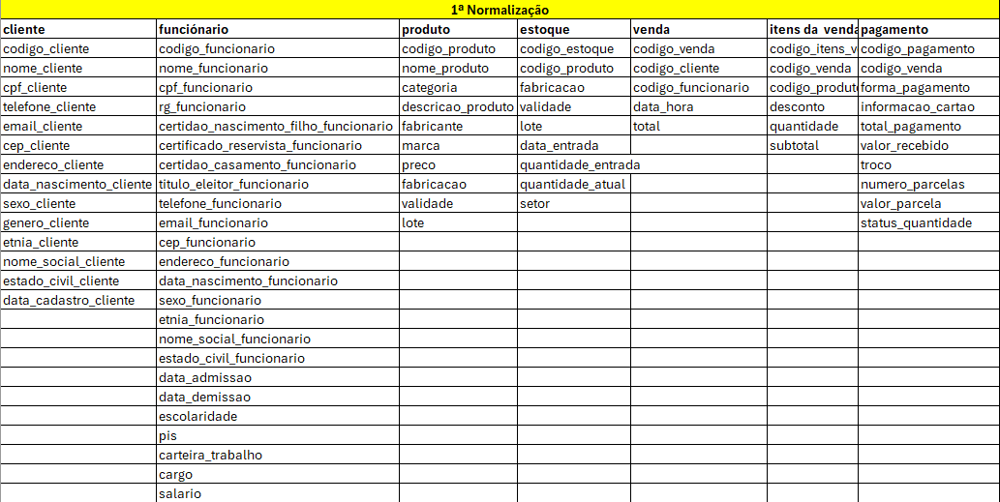
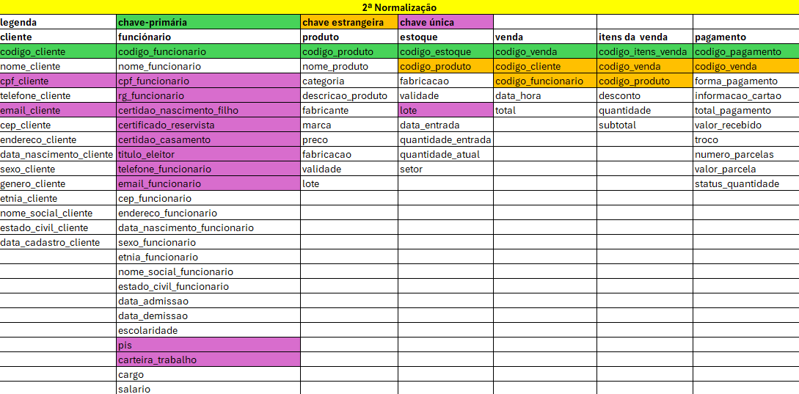
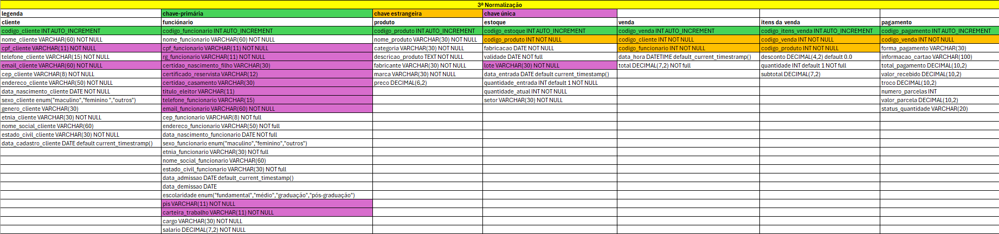

# Casa Oliveira - Banco de Dados

## Objetivo

Este projeto tem como objetivo desenvolver um banco de dados para o estudo de caso **Casa Oliveira**, aplicando conceitos de modelagem de dados, normalização e implementação em SQL. A proposta busca organizar e estruturar as informações do mercado, proporcionando maior controle sobre clientes, produtos, estoque, funcionários, vendas e pagamentos.

---

## Conteúdo

Neste repositório são apresentadas as principais etapas do desenvolvimento do banco de dados:

* Estudo de caso
* Modelo Conceitual
* Processo de Normalização (1FN, 2FN e 3FN)
* Modelo Lógico
* Modelo Físico
* Script SQL para criação do banco de dados

---

## Normalização

### Primeira Forma Normal (1FN)

  

### Segunda Forma Normal (2FN)

  

### Terceira Forma Normal (3FN)

  

---

## Tecnologias Utilizadas

* MySQL
* MySQL Workbench
* SQL

---

## Objetivo do Repositório

Este repositório reúne todas as etapas de desenvolvimento do banco de dados do estudo de caso **Casa Oliveira**, servindo como registro da aplicação prática dos conceitos de modelagem, normalização e implementação de bancos de dados relacionais.
