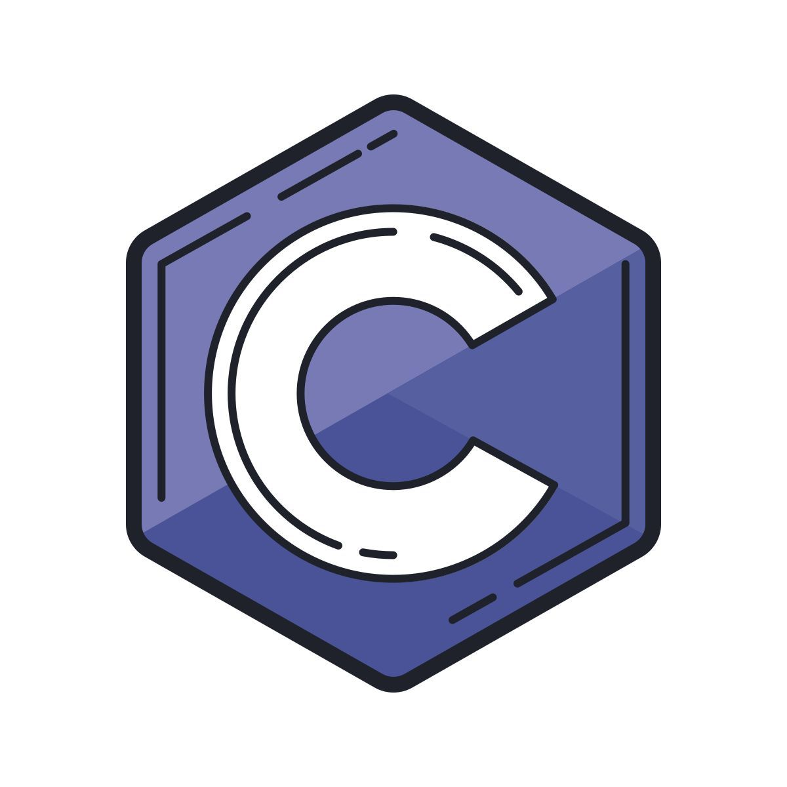

# Estudo da Linguagem C, Python e NASM

## Objetivo

A linguagem **NASM (Netwide Assembler)** foi utilizada para compreender o funcionamento interno das linguagens de alto nível, permitindo uma visão mais próxima do hardware e do processo de execução dos programas.

Além disso, foram aplicados conceitos de **lógica de programação** e **algoritmos** utilizando as linguagens **C** e **Python**, explorando desde os fundamentos da programação estruturada até a automação de tarefas e o desenvolvimento de aplicações.

<p align="center">
    
</p>

---

## Conteúdo Estudado

Neste repositório são abordadas as principais estruturas e conceitos das linguagens C e Python:

* Variáveis
* Tipos de Dados
* Operadores Aritméticos, Relacionais e Lógicos
* Comandos de Entrada e Saída (I/O - Input/Output)

  * `printf()` e `scanf()` (C)
  * `print()` e `input()` (Python)
* Estruturas de Decisão

  * Desvio de fluxo simples (`if`)
  * Desvio de fluxo múltiplo (`if...else`)
  * Estruturas condicionais encadeadas (`elif`)
* Estruturas de Repetição

  * `while`
  * `for`
* Funções (Modularização)

  * Funções internas
  * Funções externas e módulos
* Importação de Módulos

  * Bibliotecas da linguagem (`stdio.h`, `stdlib.h`, etc.)
  * Bibliotecas do usuário (`funcoes.h`)
  * Módulos Python (`math`, `os`, `random`, etc.)
* Ponteiros (C)
* Manipulação e criação de arquivos
* Listas, Tuplas e Dicionários (Python)
* Programação Orientada a Objetos (Python)
* Automação de tarefas com Python

---

## Exemplo de Estrutura Básica em C

```c
#include <stdio.h>

int main() {
    int x = 10;

    printf("O valor é %d\n", x);

    return 0;
}
```

### Saída

```text
O valor é 10
```

---

## Exemplo de Estrutura Básica em Python

```python
x = 10

print(f"O valor é {x}")
```

### Saída

```text
O valor é 10
```

---

## Tecnologias Utilizadas

* Linguagem C
* Python
* NASM (Assembly)
* GCC
* Linux

---

## Objetivo do Repositório

Este repositório tem como finalidade registrar os estudos e exercícios desenvolvidos durante o aprendizado das linguagens C, Python e NASM, abordando desde conceitos básicos até tópicos mais avançados relacionados à programação, automação, desenvolvimento de sistemas e ao funcionamento interno dos computadores.
